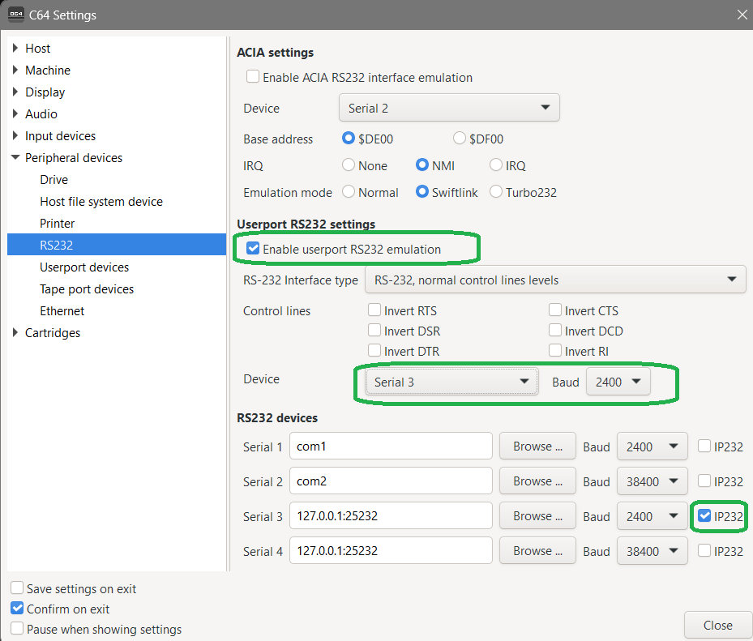
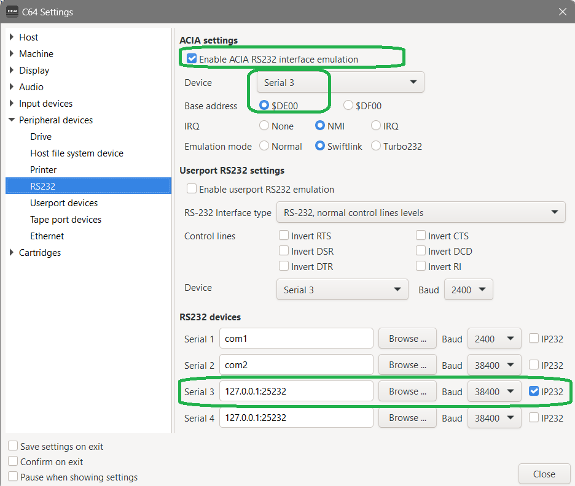

# TCPSerial Quick Start with VICE C64 Emulator on Windows 
## Step 1: Check if Java is installed
Open a command prompt and type **java -version**  
Java is installed if you see something like this:

    c:\> java -version 
    java version "21.0.4" 2024-07-16 LTS
    Java(TM) SE Runtime Environment (build 21.0.4+8-LTS-274)
    Java HotSpot(TM) 64-Bit Server VM (build 21.0.4+8-LTS-274, mixed mode, sharing)

Java is **not** installed if you see something like this:

    c:\> java -version
    'java' is not recognized as an internal or external command,
    operable program or batch file.
You will need to install Java if it is not installed, or the version installed is not at least 21.  
Java can be easily downloaded and installed from various web sites including:

* https://adoptium.net/
* https://www.oracle.com/java/technologies/downloads/

## Step 2: Download and unzip TCPSerial
On the GitHub page, go to the releases section and download the latest release .zip file.  
Unzip it into a directory of your choosing (for example: c:\commodore\tcpserial)

## Step 3: Start TCPSerial
In a command prompt, type commands similar to this:

    c:\> cd \commodore\tcpserial
    c:\> TCPSerial
    ECHO is off.
    Sep 29, 2024 6:58:16 PM   INFO    Version:showStartupMessage  TCPSerial v1.0 released on Oct 1, 2024
    Sep 29, 2024 6:58:16 PM   INFO    Version:showStartupMessage  Java Version Information:
    Sep 29, 2024 6:58:16 PM   INFO    Version:showStartupMessage    Java HotSpot(TM) 64-Bit Server VM 21.0.4+8-LTS-274
    Sep 29, 2024 6:58:16 PM   INFO    Version:showStartupMessage    Oracle Corporation
    Sep 29, 2024 6:58:16 PM   INFO    Version:showStartupMessage  Press Control-C to stop
    Sep 29, 2024 6:58:16 PM   INFO    ModemPoolThread:<init>      [C64 Modem] Type: ip232  Port: 25232  Speed: 38400bps.
    Sep 29, 2024 6:58:16 PM   INFO    ModemPoolThread:<init>      [C64 Modem] ats0=2s5=20
    Sep 29, 2024 6:58:16 PM   INFO    ModemPoolThread:<init>      [C64 Modem] Waiting for IP232 connections on port 25232

TCPSerial is now running and waiting for a program to connect to it to use its Modem Emulation Services.

## Step 4: Setup VICE to use TCPSerial
Go to Preferences -> Settings  

## Step 5: Get a terminal program for the C64
For this document, we will use the 2021 version of CCGMS.  
The .d64 image can be downloaded here:
https://commodore.software/downloads/download/59-ccgms/15582-ccgms-2021

Be sure that TCPSerial is running before you start the C64 emulator.

From within VICE, CCGMS is loaded with a simple:  

    LOAD "CCG*",8,1

    SEARCHING FOR CCG*
    LOADING
    READY.
    RUN

## Step 6: Connecting to your first Bulletin Board
Lets first make sure our modem emulation is working.  
Type the word **at** and press enter.  
If you see the word **ok** you are good to go.  

The Commodore BBS Outpost website contains a list of active BBSes that you can connect to over the internet.  
Some of these are running on actual Commodore hardware.  
http://cbbsoutpost.servebbs.com/

When you see one you like, you can connect to it by typing:  
**atdt 8bit.hoyvision.com:6400** and pressing enter.

## Step 7: Cleaning up
Once you have finished visiting some BBSes, you can safely exit out of VICE.      
You can press Control-C to end TCP Serial (or just close thw command window).  

## Bonus:  Connecting to BBSs with the sounds of the 80s
Edit the **config.xml** file that came with TCPSerial.    
Change the attribute from **playModemSounds="NO"** to **playModemSounds="YES"** and save the file.        
Startup TCPSerial and then VICE.    
TCPSerial will now make the sounds of dialing and connecting via modem when you next connect to a BBS.       
While this is kind of fun the first few times, you will quickly see why we have this option defaulted to off.  

## Bonus 2: 38,400 Connections with CCGMS
To turbo speed your data transfers, you can use a virtual SwiftLink to connect to boards at 38,400.  
Change the VICE setting to look like this instead:  

Close VICE and TCPSerial.  
Start TCPSerial and then VICE.  
Once you load CCGMS, press F7 to get into the setup screen.    
Change **Modem Type** to **Swift / Turbo DE**  
Change the **Baud Rate** to **38,400**  

Now you will be BBSing at top speed.  

